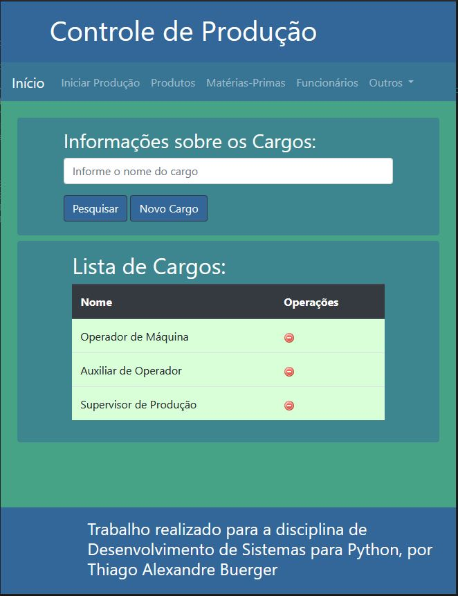

# ProjetoControleProducao

### Projeto utilizado na disciplina de Desenvolvimento de Sistemas em Python, apresentando como tema um controle de produção.

Neste contexto, o sistema deverá controlar o estoque de produtos e de matérias-primas, que serão cadastrados previamente (com estoque em 0). Com isso, o sistema irá controlar as produções que estão em processo e as produções já finalizadas. Toda produção apresenta um produto produzido e a sua quantidade esperada. Ao finalizar a produção, o estoque do produto deverá ser atualizado.

Toda produção apresenta também um ou mais processos, cada processo com sua hora inicial e final, que serão usadas para calcular o tempo gasto em cada processo e o tempo da produção inteira. Cada processo pode utilizar uma, nenhuma ou várias matérias-primas, que serão descontadas do estoque ao final de cada processo e serão utilizadas para calcular o custo do processo e da produção. Um produto já finalizado também poderá ser utilizado na produção de um novo produto.

O processo será realizado por um ou mais funcionários, além de possuir um supervisor. Os funcionários apresentarão um cargo, já cadastrado no sistema.

Ao ser finalizado, um processo pode ser aprovado ou não. Assim, a produção pode apresentar processos repetidos, ou seja, com o mesmo tipo de processo (que será cadastrado previamente). Os processos reprovados aumentarão o tempo e o custo da produção.

Neste contexto não estão sendo controladas as vendas dos produtos e nem a compra de matéria-prima, que poderá ser um módulo implementado futuramente.

#### Diagrama de Classes

### Sistema em execução

Até o momento, a página de Cargos está listando e permitindo a adição e exclusão de Cargos. Entretanto, mesmo com a classe Funcionario implementada, a exclusão de Cargos ainda não verifica se o cargo excluído está vinculado a algum Funcionario.

### Observação

Para que o reaproveitamento de HTML das páginas funcione, é necessário adicionar o projeto num servidor e acessar por localhost, e não acessar as páginas diretamente pelo navegador.
