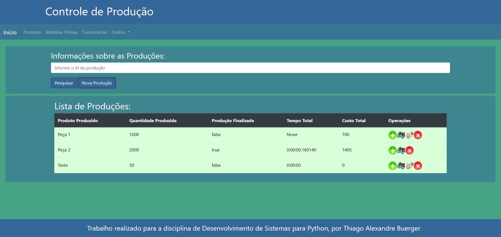

# ProjetoControleProducao

### Projeto utilizado na disciplina de Desenvolvimento de Sistemas em Python, apresentando como tema um controle de produção.

Neste contexto, o sistema deverá controlar o estoque de produtos e de matérias-primas, que serão cadastrados previamente (com estoque em 0). Com isso, o sistema irá controlar as produções que estão em processo e as produções já finalizadas. Toda produção apresenta um produto produzido e a sua quantidade esperada. Ao finalizar a produção, o estoque do produto deverá ser atualizado.

Toda produção apresenta também um ou mais processos, cada processo com sua hora inicial e final, que serão usadas para calcular o tempo gasto em cada processo e o tempo da produção inteira. Cada processo pode utilizar uma, nenhuma ou várias matérias-primas, que serão descontadas do estoque ao final de cada processo e serão utilizadas para calcular o custo do processo e da produção. Um produto já finalizado também poderá ser utilizado na produção de um novo produto.

O processo será realizado por um ou mais funcionários, além de possuir um supervisor. Os funcionários apresentarão um cargo, já cadastrado no sistema.

Ao ser finalizado, um processo pode ser aprovado ou não. Assim, a produção pode apresentar processos repetidos, ou seja, com o mesmo tipo de processo (que será cadastrado previamente). Os processos reprovados aumentarão o tempo e o custo da produção.

Neste contexto não estão sendo controladas as vendas dos produtos e nem a compra de matéria-prima, que poderá ser um módulo implementado futuramente.

#### Diagrama de Classes


### Observação

Para que o reaproveitamento de HTML das páginas funcione, é necessário adicionar o projeto a um servidor e acessar os arquivos html pelo servidor, e não acessar as páginas diretamente. Isso ocorre por conta do erro gerado pelo navegador ao tentar adicionar as partes html na página:

```
Access to XMLHttpRequest at 'file:///C:/Users/Thiago/Documents/TADS%206/Python/Projeto%20Controle%20de%20Produ%C3%A7%C3%A3o/ProjetoControleProducao/view/partesHTML/cabecalho.html' from origin 'null' has been blocked by CORS policy: Cross origin requests are only supported for protocol schemes: http, data, chrome, chrome-extension, chrome-untrusted, https.
```

### Sistema em execução

O sistema apresenta as telas que permitem listagem, cadastro, edição (ícone de lápis) e exclusão (ícone vermelho com "X") dos cargos e dos tipos de processos, que são as classes básicas, ou seja, não necessitam de outros dados pré-cadastrados para serem salvas. A pesquisa por id também está disponível e, quando se pesquisa sem informar um id, todos os dados serão listados. O cadastro e edição possuem pequenas validações do lado do servidor, retornando mensagens de erro ao usuário. A exclusão de cargos e tipos de processos só será possível para aqueles que não estiverem vinculados a funcionários ou processos já cadastrados.

**Tela Cargos, com listagem, pesquisa, cadastro, edição e exclusão.**


**Tela Tipos de Processos, mostrando a edição de um tipo de processo.**


Outras telas com classes básicas são a de produtos e matérias-primas, pois não necessitam de dados pré-cadastrados. Entretanto, estas classes são especializações da classe Material, ou seja, possuem vínculo de herança com esta classe. Ambas possuem atributos semelhantes, mas diferem em diversos pontos. O produto será cadastrado para posteriomente ser iniciadas as produções deles. Neste caso, não é possível definir o estoque, o valor unitário e nem o valor de venda, pois serão gerados automaticamente conforme as produções forem finalizadas.

**Tela Produtos, mostrando a tela de cadastro de novo produto.**


Já as matérias-primas necessitam da informação de valor unitário para que o cálculo dos custos da produção sejam realizados. É possível também adicionar ao estoque das matérias-primas (ícone verde com "+"), como se fosse realizado uma compra. Tanto os produtos quanto os matérias-primas possuem restrições na edição de dados e na hora de exclusão, que não será possível caso estejam vinculados e um processo ou produção.

**Tela Matérias-Primas, mostrando a opção de adicionar ao estoque.**


A tela de funcionários apresenta as mesmas funções das anteriores, se destacando apenas no fato de possuir um campo de seleção de cargos na hora de cadastrar ou editar um funcionário. Novamente, um funcionário não poderá ser excluído se estiver realizando um processo ou for supervisor de um.

**Tela Funcionários, mostrando a opção de adicionar novo funcionário com seleção de cargos.**


A tela inicial apresenta a lista de todas as produções e algumas funções para cada uma, além da pesquisa e cadastro de novas produções. Uma nova produção requer as informações do produto que será produzido e da quantidade produzida, sendo o tempo total e o custo total da produção gerados pelo sistema.

**Tela Inicial, mostrando a lista de produções.**


A primeira função (ícone verde com "+") é para adicionar um novo processo na produção, selecionando qual o seu tipo e qual o supervisor responsável pelo processo. A data e hora inicial do processo é gerada pelo sistema.

**Tela Novo Processo.**


A segunda função (ícone do binóculos) é para mostrar os processos referentes à produção, além de novas funções (que serão tratadas adiante). A terceira opção (ícone da mão fazendo "ok") é para finalizar a produção, aparecendo apenas para as produções não finalizadas. Esta função define o tempo e custo total da produção, baseados nos processos referentes a ela, e realiza a atualização do estoque de produtos e o cálculo do valor unitário e do valor de venda. A quarta função (ícone vermelho com "X") é para excluir uma produção que ainda não esteja finalizada e nem que contenha processos adicionados.

Voltando à função de mostrar processos da produção, novas funções poderão ser realizadas para cada processo. A primeira e a segunda função (ícones redondos verde e vermelho) são para aprovar e reprovar, respectivamente, o processo. Essas funções somem quando o processo é aprovado, momento onde também se finaliza o processo, gerando sua data e hora final, e calculando o tempo e custo total do processo, que será utilizado para calcular os mesmos dados da produção.

**Tela Novo Processo.**


A terceira função da tela da listagem de processos da produção (ícone de objetos como pirâmede, cubo e esfera) é para mostrar os materiais utilizados no processo. Nesta nova tela é possível adicionar novos materiais, podendo ser utilizados tanto matérias-primas quanto produtos já produzidos internamente.

**Tela Adicionar Material no Processo.**


A quarta função (ícone de prancheta com funcionário) é semelhante a anterior, mas para mostrar os funcionários envolvidos no processo e possibilitar alocar novos funcionários ao processo.

**Tela Adicionar Material no Processo.**


Foi implementado as funções de excluir o funcionário e materiais do processo, retornando o valor dos materiais ao estoque, mas a implementação de exclusão de processos e até de produções já finalizadas não estão completas, por necessitarem de exclusões em cascata e de recalcular o estoque de produtos e matérias-primas.